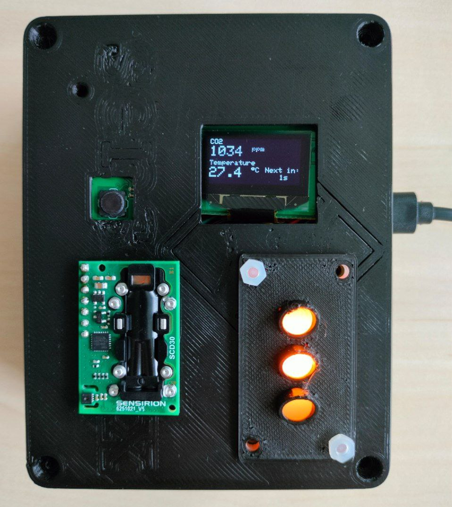

# ESP32 Arduino CO2 & Temperature Project

This project uses an ESP32 with Arduino to measure **CO2 concentration** and **temperature**.

## Features
- Reads CO2 sensor values
- Reads temperature
- Sends/prints data via Serial/other interface

## Hardware
- ESP32 SenseBoxMCU
- Co2 Sensor - Sensirion SCD30 
- Temperature sensor -  HDC1080
- OLED Display - ssd1306 
- LED Matrix
- Wires
- 3D printed cases, Screws

## Pictures

## How to Upload
1. Open the `.ino` file in Arduino IDE
2. Select the correct ESP32 board from *Tools > Board* and give authentication details for the WiFi.
3. Upload to your ESP32

## License
This project is licensed under "All Rights Reserved".  
You may not copy, modify, distribute, or use this code without explicit permission from the author.

